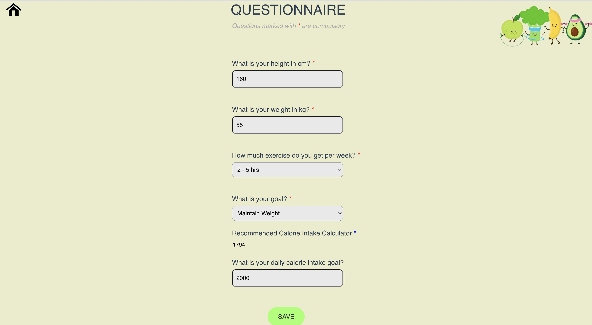
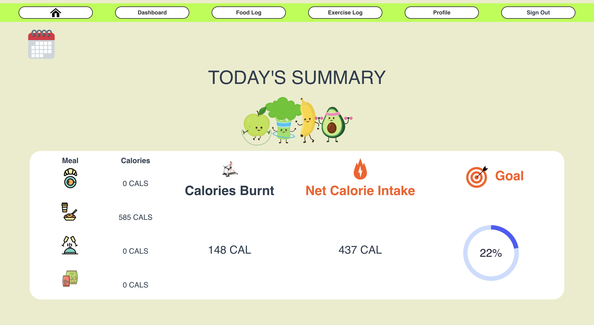
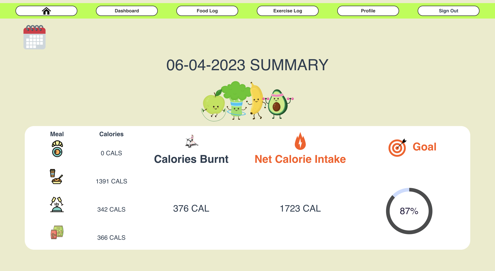
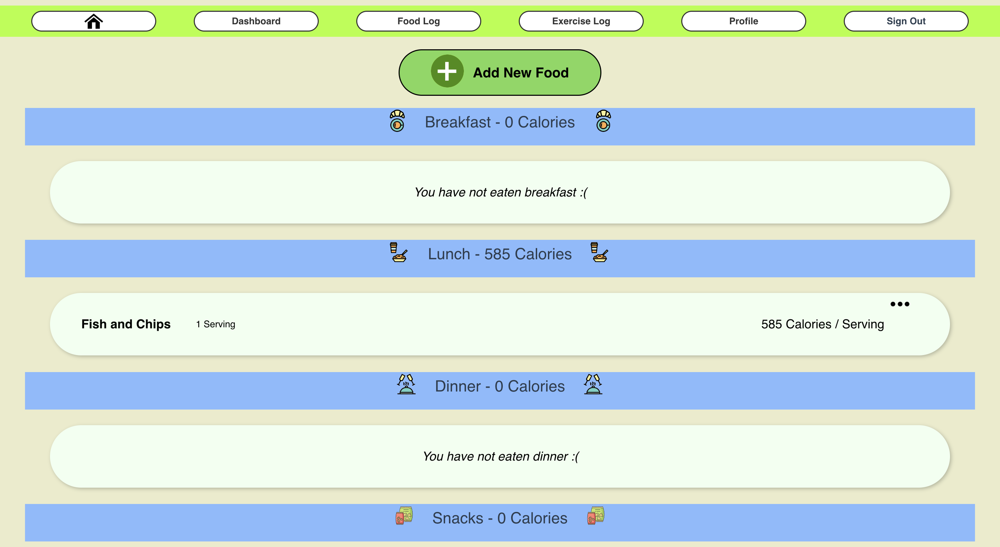
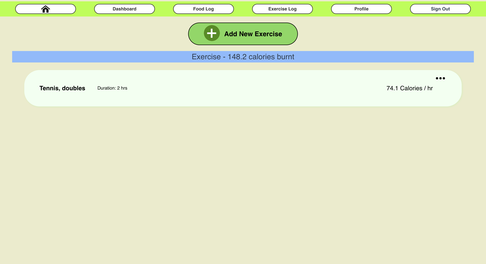

# Calorie Tracking App
happyplates-b82ce.web.app

## Overview
- A web application that allows users to track their daily food intake and exercise routine. The application will provide recommendations for the ideal amount of calories to consume per day based on the user's goals, such as weight loss, weight gain, or maintaining a healthy weight, together with their food intake and amount of exercise.

## Features
- Questionnaire page

- Homepage

- Calendar

- Food Log Page

- Exercise Log Page

- Dashboard

## Screenshots

## Video Demo
https://youtu.be/tNI8e_LloGs
